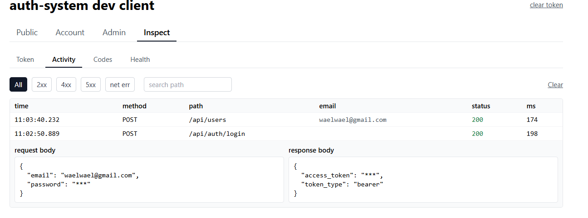
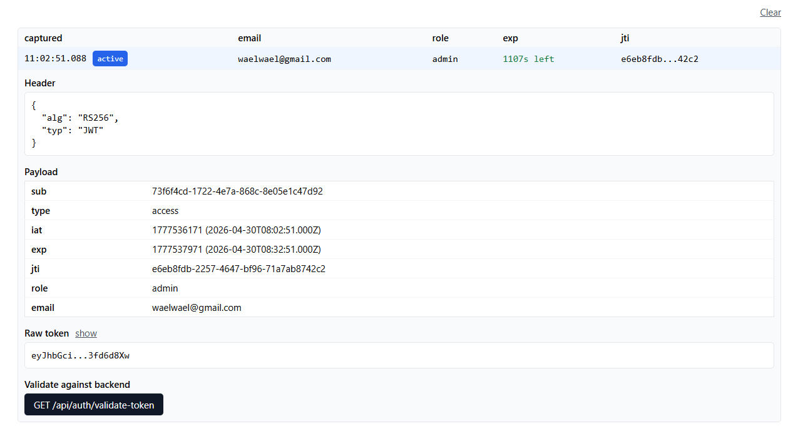
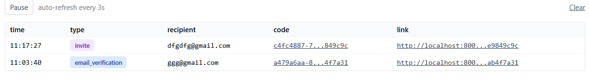

# Dev client screenshots

Walkthrough of the `dev-client/` **Inspect** tab — the in-browser debugging surface that ships with the auth-system. Each panel below is a different sub-section of the same `Inspect` page.

---

## Activity log

Every API call the dev client makes is captured here with method, path, status (color-coded), latency, and click-to-expand request and response bodies. Passwords and bearer/refresh tokens are redacted before they reach `sessionStorage`. The `email` column shows whose token authorized each call. `/api/dev/*` infrastructure paths are excluded so the trace stays clean while you're tracing real flows.

---

## Token

A history of every JWT that flowed through the client (login, refresh, OAuth callback). Click a row to expand the decoded header and payload, watch the live `exp` countdown, and — on the currently active token — compare the locally-decoded claims against the backend's view via `GET /api/auth/validate-token`.

---

## Codes

Verification, password-reset, and invite codes captured live from the dev branch in `app/utils/email.py`. Auto-refreshes every three seconds; click-to-copy on both the code and the verification link. Backed by an in-memory ring buffer exposed at `GET /api/dev/codes`, registered only when `ENVIRONMENT != "production"` (the production gate is enforced at the route-registration level *and* re-checked in the handler — the endpoint returns 404 outside dev).

